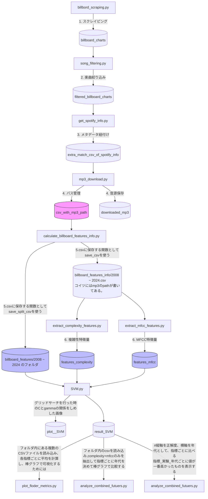

# 🎵 Billboard Japan Music Analysis Project (2009-2025)

Billboard Japan Hot 100のチャートデータから楽曲データ（曲名、アーティスト名、順位）を取得（フォルダ名：billboard_charts）。
SpotifyAPIと楽曲データ用いて、音源（mp3）を取得し、楽曲の複雑性特徴量とMFCC特徴量を抽出してSVMで解析するものである。

 

## 最初に
+ 最初に自分の論文を読んで。わからない単語がある可能性があります。
+ SpotifyAPIを取得する必要があります（無料。2026/2/17時点）。
+ 入力先、出力先のフォルダとかは、プログラムの最初に定義しているので、必要がある場合変える。
+ データは全てSCVで保存される

 

## ライブラリ

pandas, matplotlib, seaborn, os, glob, 
librosa, pandas, sklearn, spotipy, spotdl 等が必要です

 

## 📊 データフロー図 (Data Pipeline)
 

各スクリプトの実行順序と、生成されるディレクトリの関係を可視化しています。
 

 

### データの説明
#### billboard_charts
+ 2008年～2025年の週間ごとのランキング情報
+ フォルダー/20xx/20xx_00_00.csv　の形
+ 順位,　曲名,　アーティスト名,　ランクスコア

#### filtering_billboard_charts
+ スクレイピングした情報から、3回以上登場した曲のみを抽出。
+ フォルダー/20xx/20xx_00_00.csv　の形
+ 順位,　曲名,　アーティスト名,　ランクスコア

#### extra_mathch_csv_of_spotify_info
+ SpotifyAPIを用いて、SpotifyのメタデータやURLを取得
+ フォルダー/20xx/20xx_00_00.csv　の形
+ アーティスト名,　曲名,　順位,　Spotify URL,　アーティスト人気度,　曲人気度
+ フォルダ名のextraだが、完全一致を表したもの。APIを使う時、曲名で検索して情報を取得している。ここで曲名が完全一致するものを取得するようにしている。gitを遡るとpartial_mathch_csv_of_spotify_infoがあるはず。
これは名前が部分一致したもの。（星野源には「ドラえもん」と「夢を叶えてドラえもん」が存在し、データを確実性をとった）

#### csv_with_mp3_path
+ spotdlを使用して、URLから音源を取得
+ 音源が保存してあるpathが書いてある
+ フォルダー/20xx/20xx_00_00.csv　の形
+ アーティスト名,曲名,順位,Spotify URL,アーティスト人気度,track人気度,MP3_Local_Path

#### billboard_features
+ calculate_billboard_features_info.pyで保存する関数save_split_csvを使って保存したもの
+ 年ごとにまとめた。
+ フォルダー/20xx.csv　の形

#### billboard_features_info
+ calculate_billboard_features_info.pyで保存する関数save_csvを使って保存したもの
+ 年ごとのファイルを一つにまとめたにまとめた。
+ フォルダー/20xx〜20xx.csv　の形

#### extract_complexity_features
+ complexity特徴量を抽出。どの曲がなんの特徴量を持っているかを調べるためにURLを持っている
+ Artist,Track,URL,MP3_Path　＋　特徴量

#### extract_mfcc_features
+ mfcc特徴量を抽出。どの曲がなんの特徴量を持っているかを調べるためにURLを持っている
+ Artist,Track,URL,MP3_Path　＋　特徴量

#### result_SVM
+ 正答率を保存
+ 横軸が使用した特徴量、縦軸が人気度指標
+ フォルダー/20xx~20xx.csv　の形
+ train + val + testで使った年の範囲になっている。 
+ 今のフォルダ内にはtrainに使った年や、グリッド法を使ったか、なのでフォルダーを変えているので、ぐちゃぐちゃに保存されている。

## 補足

+ send_email.py：これはモジュールとして使われている。実行時間が長いプログラムに入ってる。プログラムが終わったタイミングでgmailに送れる。自分のgmeilでidかなんかを作っていろいろしないといけないので使わなかったら使われているところをコメントアウトして。
+ for_features_csv.py：よく使う関数をモジュールとして保存した。どこに埋め込んでいるかわからなくて下手に消せない、、、
+ MPEG7：外部ソフトウェア。昔に作られていて、バージョンの互換性とか合わなくて使えない。