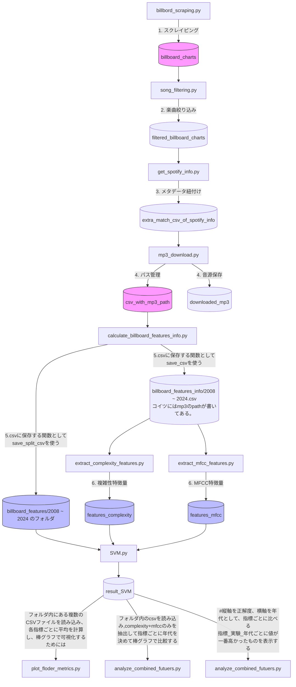

# 🎵 Billboard Japan Music Analysis Project (2009-2025)

Billboard Japan Hot 100のチャートデータから楽曲データ（曲名、アーティスト名、順位）を取得。
SpotifyAPIと楽曲データ用いて、音源（mp3）を取得し、楽曲の複雑性特徴量とMFCC特徴量を抽出してSVMで解析するものである。

## ライブラリ

pandas, matplotlib, seaborn, os, glob, 
librosa, pandas, sklearn, spotipy 等が必要です

## 📊 データフロー図 (Data Pipeline)

各スクリプトの実行順序と、生成されるディレクトリの関係を可視化しています。

## 補足

+ send_email.py：これはモジュールとして使われている。実行時間が長いプログラムに入ってる。プログラムが終わったタイミングでgmailに送れる。
+ for_features_csv.py：よく使う関数をモジュールとして保存した。どこに埋め込んでいるかわからなくて下手に消せない、、、
+ MPEG7：外部ソフトウェア。昔に作られていて、バージョンの互換性とか合わなくて使えない。

## 補足

+ send_email.py：これはモジュールとして使われている。実行時間が長いプログラムに入ってる。プログラムが終わったタイミングでgmailに送れる。
+ for_features_csv.py：よく使う関数をモジュールとして保存した。どこに埋め込んでいるかわからなくて下手に消せない、、、
+ MPEG7：外部ソフトウェア。昔に作られていて、バージョンの互換性とか合わなくて使えない。